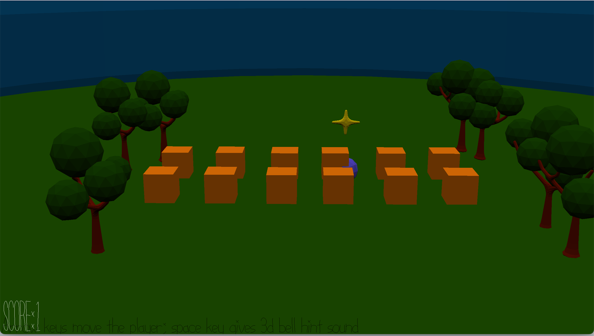

# Seeking stars

Author: Yilin Wang

Design: This game use the location of the sound to help player locate the location of the hidden stars. The goal of this game is to find as many stars as possible. 

Screen Shot:

How To Play:

The hidden star is in one of the boxes in the scene. Use arrow keys to control the player. Use space keys to make the hidden star make sound and the location of the sound give the location of the hidden star relative to the current location of the player. The score will increase by one as soon as the player run into the corresponding box. As soon as the star is located, a yellow star model will rise from the original box to mark the previous location of the star and then the star will be randomly hidden in another box(note at this time the yellow star model doesn't disappear; however, the location of the hidden star is changed). Then, the player can continue looking for the hidden star. 

This game was built with [NEST](NEST.md).
